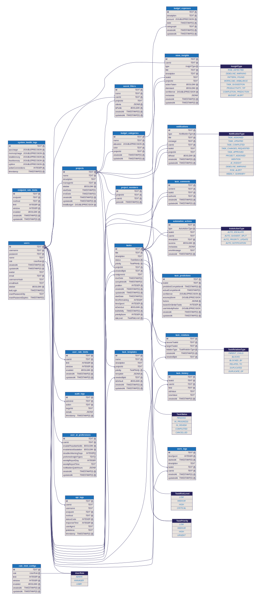

# Software Architecture

This document describes the software architecture of TaskForge, aligned with the design principles of tiered responsibility.

## Architecture Overview

The system follows a layered architecture to ensure separation of concerns, maintainability, and scalability.

### 1. Presentation Layer
- **Location**: `client/`
- **Technology**: React, Vite, TailwindCSS
- **Responsibility**: User interface, state management, and interaction with the API.

### 2. Logic Layer

The Logic Layer is divided into two distinct parts:

#### Program Logic
- **Location**: `server/src/routes/`, `server/src/middleware/`, `server/src/controllers/`
- **Responsibility**:
    - **Routing**: Mapping incoming HTTP requests to specific handlers.
    - **Middlewares**: Handling cross-cutting concerns like Authentication, Logging, and Rate Limiting.
    - **Validation**: Enforcing request schema validation using Joi/Zod via `validateRequest` middleware.
    - **Flow Control**: Controllers manage the HTTP request/response cycle and delegate business operations to Services.

#### Business Logic
- **Location**: `server/src/services/`
- **Responsibility**:
    - **Domain Rules**: Implementing the core logic of the application (e.g., Task management, User permissions).
    - **Orchestration**: Coordinating multiple data operations or external service calls.
    - **Abstraction**: Encapsulating complex calculations and domain-specific logic away from the transport layer (HTTP).

### 3. Data Layer
- **Location**: `server/src/prisma/`
- **Technology**: Prisma ORM, PostgreSQL
- **Responsibility**: Data persistence, schema management, and migrations.

### 4. External Services
- **Location**: `server/src/services/websocket.service.js`, `server/src/automation/`
- **Responsibility**:
    - **Real-time Communication**: Web Sockets for live updates.
    - **Background Tasks**: BullMQ for handling asynchronous operations.

---

## Key Principles
- **Controllers stay thin**: They should only parse input, call a service, and return a response.
- **Services are transport-agnostic**: Logic should not depend on `req` or `res`.
- **Validation at the edge**: Ensure all inputs are validated before they reach any logic handlers.
